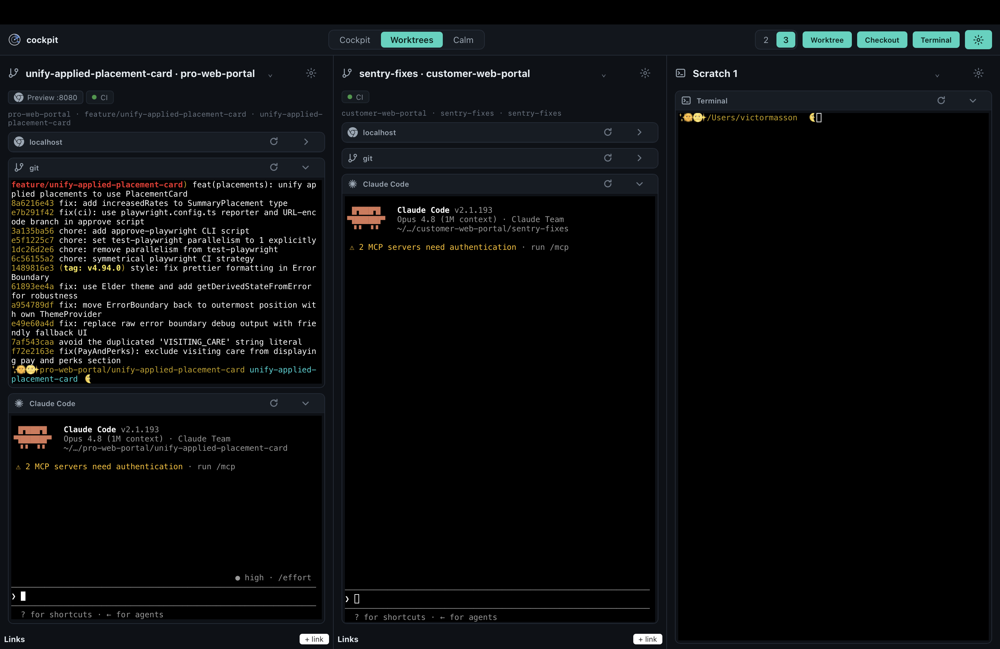

# Cockpit

A macOS desktop **dev cockpit**: a workspace that runs several live terminals in
organised tiles (connected to git worktrees), with side panels that pull in the
tools you'd otherwise app-switch to — Slack, Linear, GitHub, Calendar.

The terminals are the heart; integrations are panels around them.

## What it does

- **Worktrees view** — three column slots, each running one git worktree with its
  own terminals (host / git / claude). Create a new worktree from a natural-language
  prompt, or check out an existing branch. Scratch login-shell terminals too.
- **Smart new-worktree** — describe what you want to work on; Cockpit deduces the
  repo, branch, start command and dev URL. Paste a **Linear ticket**, **GitHub
  PR/issue**, or **Slack permalink** and it resolves the source and stages a link.
- **Worktree teardown** — a gear menu on each slot offers four cumulative actions:
  **Close** (unassign the slot) → **Pause** (also kill its terminals, keep the branch) →
  **Delete** (also `git worktree remove`, branch kept) → **Wipe** (also `git branch -D`,
  local only). Delete/Wipe confirm first and warn if the worktree is dirty.
- **Attention highlight** — when Claude Code (in a worktree's Claude pane or a scratch
  terminal) rings the terminal bell to ask for you, the pane lights up with a warm glow
  until you type a response. Requires a one-time Claude setup (below).
- **Tiles** — a **Slack unread** tile (watched channels, with preview + relative time;
  click a row to jump to Slack), plus local **To Do** and **Timer** widgets, all built
  on a shared `<Tile>` shell.
- **Panel system** — an extensible provider/panel pattern so integrations (Slack first,
  then Linear/GitHub/Calendar) can be added one at a time without re-architecting.
  Tokens live in the macOS Keychain; connect integrations in **Settings → Connections**.

## Claude Code setup

The attention highlight detects Claude Code's **terminal bell**. For it to fire, set the
notification channel in `~/.claude/settings.json` (one-time, applies to all your Claude
sessions):

```json
{ "preferredNotifChannel": "terminal_bell" }
```

Claude then writes a bell (`\x07`) when it needs you (permission prompts / input needed);
Cockpit highlights that pane. Note Claude rings after a short idle interval, not the
instant a prompt appears — so expect a brief delay. Without this setting (default
`"auto"`), Claude sends no bell in Cockpit's terminal and no pane will highlight.

## Slack tile setup

The Slack unread tile talks directly to Slack with your own app (no third-party server;
the token is stored in the macOS Keychain). One-time setup:

1. Create a Slack app at [api.slack.com/apps](https://api.slack.com/apps).
2. Add the **User Token Scopes** the tile needs (read channels/messages) and a redirect
   URL of `http://localhost:9000/callback` (Cockpit's loopback OAuth uses ports 9000–9009).
3. In Cockpit, open **Settings → Connections**, paste the app's client id/secret, then
   **Connect** to run the OAuth round-trip and pick the channels to watch.

## Stack

| Layer | Choice |
|-------|--------|
| Shell | [Tauri v2](https://tauri.app) (native macOS, ~10–30 MB) |
| Frontend | React 19 + TypeScript (Vite), Zustand store |
| Backend | Rust core — owns PTYs, OS keychain, OAuth, polling |
| Terminal | [xterm.js](https://xtermjs.org) + [`portable-pty`](https://crates.io/crates/portable-pty) |
| Secrets | macOS Keychain |

The Rust core owns everything stateful/privileged; the React webview is pure
presentation, talking to the core over Tauri IPC.

## Development

```bash
npm install
npm run tauri dev      # run the app
npm run build          # type-check + build frontend
npm test               # frontend tests (vitest)
cd src-tauri && cargo test   # Rust tests
```

App config lives in `~/Library/Application Support/com.cockpit.app/`
(`cockpit.json` user config + `layout.json` geometry); worktrees are created
under `~/CockpitWorktrees/<repo>/<name>`.

## Docs

- Product spec — `docs/superpowers/specs/2026-06-16-cockpit-product-spec.md`
- Backlog / next work — `docs/ROADMAP.md`
- Architecture & conventions — `CLAUDE.md`

> Learning project: code favours small, readable changes over polish, and files
> carry concise role comments. See `CLAUDE.md` for conventions.

## Current state


